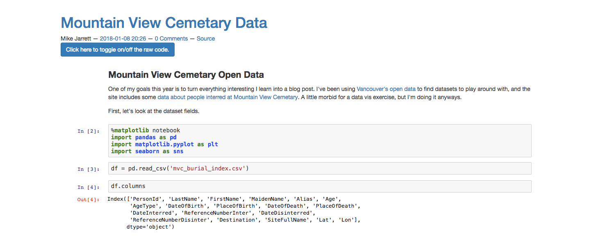
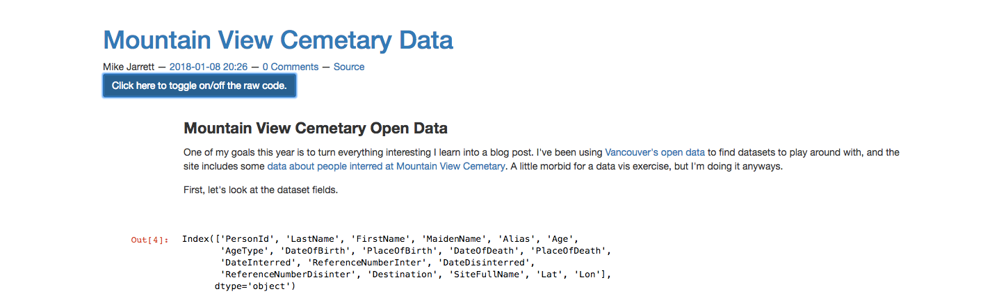

# Bootyper

An extension of the default bootstrap3 theme for Nikola websites with improved support for Jupyter notebooks.

This theme makes two improvements to the default theme:

* Removes ugly boxes around input and output prompts
* Adds button at top of each post to hide/reveal code cells

